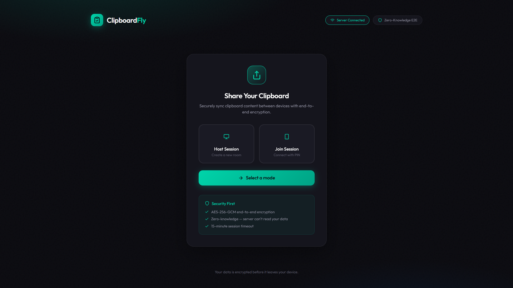

# Clipboard Fly Server

WebSocket relay server for [Clipboard Fly](https://github.com/imr4n4lif/clipboard-fly-frontend) — secure clipboard sharing with zero-knowledge encryption.



## Security

- **Zero-knowledge** — Server only relays encrypted blobs, can't read your data
- **AES-256-GCM** encryption (client-side)
- **15-minute** session timeout
- **Max 2 devices** per room

## Run Locally

```bash
npm install
npm start
```

Server runs on `http://localhost:3000`

## Environment Variables

| Variable | Default | Description |
|----------|---------|-------------|
| `PORT` | `3000` | Server port |
